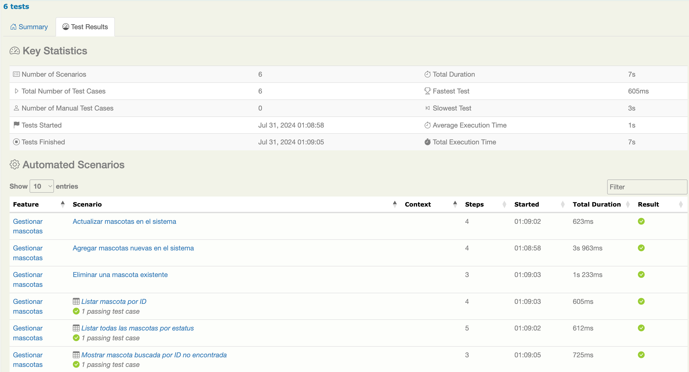

# PRUEBAS INTEGRALES (BDD): petstore3

## Feature: Gestionar mascotas

Esta característica proporciona funcionalidad para gestionar mascotas en el sistema. Basado en los resultados de las pruebas, los siguientes escenarios han sido implementados y probados exitosamente:

Esta es una implementación de muestra de un servidor de tienda de mascotas basado en la especificación OpenAPI 3.0. Utiliza el enfoque "design first", lo que permite mejorar la API en general y exponer algunas de las nuevas características en OAS3.

### Scenarios
1. Agregar mascotas nuevas en el sistema
2. Actualizar mascotas en el sistema
3. Listar todas las mascotas por estatus
4. Listar mascota por ID
5. Eliminar una mascota existente
6. Mostrar mascota buscada por ID no encontrada

### Test Coverage
- Cobertura total de pruebas: 100%
- Todos los escenarios enumerados han pasado sus respectivos casos de prueba
  
### Additional Information
- Informe generado: 31-07-2024 00:42
- Herramienta utilizada: Serenity BDD
- [Repositorio de la Tienda de Mascotas](https://github.com/swagger-api/swagger-petstore)
- [Definición de la API fuente para la Tienda de Mascotas](https://github.com/swagger-api/swagger-petstore/blob/master/src/main/resources/openapi.yaml)
- URL de la API: https://petstore3.swagger.io/api/v3/openapi.json

