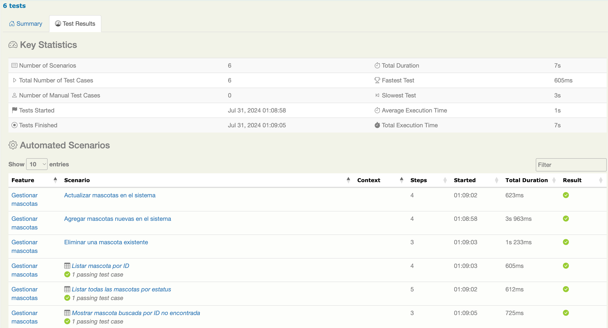

# PRUEBAS INTEGRALES (BDD): petstore3

## Feature: Gestionar mascotas

Esta característica proporciona funcionalidad para gestionar mascotas en el sistema. Basado en los resultados de las pruebas, los siguientes escenarios han sido implementados y probados exitosamente:

## Tecnologías Utilizadas
- **Cucumber**: Para desarrollo basado en comportamiento (BDD).
- **Serenity BDD**: Para gestión e informes de resultados de pruebas.
- **Java 17**: Lenguaje de programación.
- **Maven 3.9.6**: Gestión de construcción y dependencias.

## Funcionalidad: Gestión de mascotas

Esta es una implementación de muestra de un servidor de tienda de mascotas basado en la especificación OpenAPI 3.0.

### Escenarios

#### 1. Agregar Mascotas Nuevas en el Sistema
- **Etiqueta:** `@AgregarMascotasNuevas`
- **Escenario:** Agregar mascotas nuevas en el sistema
- **Pasos:**
  - **Dado** que el cliente tiene los datos de la nueva mascota
    ```json
    {
      "id": 44,
      "name": "doggie43",
      "category": {
        "id": 1,
        "name": "Dogs"
      },
      "photoUrls": [
        "string"
      ],
      "tags": [
        {
          "id": 0,
          "name": "string"
        }
      ],
      "status": "available"
    }
    ```
  - **Cuando** el cliente realiza una petición POST a `/pet` con los detalles de la nueva mascota
  - **Entonces** el servidor debe responder con status 200
  - **Y** el cuerpo de la respuesta debe contener los detalles del nuevo tipo de mascota registrado

#### 2. Actualizar Mascotas en el Sistema
- **Etiqueta:** `@ActualizarMascotas`
- **Escenario:** Actualizar mascotas en el sistema
- **Pasos:**
  - **Dado** que el cliente tiene los datos de la mascota a actualizar
    ```json
    {
      "id": 44,
      "name": "doggiee",
      "category": {
        "id": 1,
        "name": "Dogs"
      },
      "photoUrls": [
        "string"
      ],
      "tags": [
        {
          "id": 0,
          "name": "string"
        }
      ],
      "status": "available"
    }
    ```
  - **Cuando** el cliente realiza una petición PUT a `/pet` con los detalles de la mascota actualizada
  - **Entonces** el servidor debe responder con status 200
  - **Y** el cuerpo de la respuesta debe contener los detalles de la mascota actualizada

#### 3. Listar Todas las Mascotas por Estatus
- **Etiqueta:** `@ListarMascotasPorStatus`
- **Escenario Outline:** Listar todas las mascotas por estatus
- **Pasos:**
  - **Dado** que el cliente configura la URI base
  - **Cuando** el cliente realiza una petición GET a `<uri>`
  - **Entonces** el servidor debe responder con status `<statusCode>`
  - **Y** el cuerpo de la respuesta contiene la propiedad `status` con el valor `<petStatus>`
  - **Y** el cuerpo de la respuesta contiene la propiedad `id` con el valor `<petId>`
  - **Ejemplos:**

    | uri       | statusCode | petStatus   | petId |

    |-----------|------------|-------------|-------|

    | "/pet/44" | 200        | "available" | 44    |

#### 4. Listar Mascota por ID
- **Etiqueta:** `@ListarMascotasPorId`
- **Escenario Outline:** Listar mascota por ID
- **Pasos:**
  - **Dado** que el cliente configura la URI base
  - **Cuando** el cliente realiza una petición GET a `<uri>`
  - **Entonces** el servidor debe responder con status `<statusCode>`
  - **Y** el cuerpo de la respuesta contiene la propiedad `id` con el valor `<petId>`
- **Ejemplos:**

  | uri       | statusCode | petId |

  |-----------|------------|-------|

  | "/pet/44" | 200        | 44    |

#### 5. Eliminar una Mascota Existente
- **Etiqueta:** `@EliminarMascotaExistente`
- **Escenario:** Eliminar una mascota existente
- **Pasos:**
  - **Dado** que el cliente configura la URI base
  - **Cuando** el cliente realiza una petición DELETE a `/pet/{id}` con id tipo de mascota eliminado 44 y apiKey 44
  - **Entonces** el servidor debe responder con status 200

#### 6. Mostrar Mascota Buscada por ID No Encontrada
- **Etiqueta:** `@MascotasPorIdNoEncontrada`
- **Escenario Outline:** Mostrar mascota buscada por ID no encontrada
- **Pasos:**
  - **Dado** que el cliente configura la URI base
  - **Cuando** el cliente realiza una petición GET a `<uri>`
  - **Entonces** el servidor debe responder con status `<statusCode>`
  - **Ejemplos:**

    | uri        | statusCode |
  
    |------------|------------|
  
    | "/pet/100" | 404        |


### Test Coverage
- Cobertura total de pruebas: 100%
- Todos los escenarios enumerados han pasado sus respectivos casos de prueba



### Additional Information
- Informe generado: 31-07-2024 00:42
- [Repositorio de la Tienda de Mascotas](https://github.com/swagger-api/swagger-petstore)
- [Definición de la API fuente para la Tienda de Mascotas](https://github.com/swagger-api/swagger-petstore/blob/master/src/main/resources/openapi.yaml)
- URL de la API: https://petstore3.swagger.io/api/v3/openapi.json

### Ejecución de Pruebas

Para ejecutar las pruebas e2e, utiliza el siguiente comando:

```sh
mvn clean verify
```


